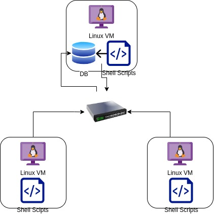

# Linux Cluster Monitoring Agent

## Table of Contents

- [Introduction](#Introduction)
- [Quick Start](#QuickStart)
- [Implementation](#Implementation)
- [Test](#Test)
- [Deployment](#Deployment)
- [Improvements](#Improvements)

## Introduction
In this project, Linux cluster Administration team developed a solution to monitor and manage the cluster of 10 servers/nodes. This application will allow the server users to retrieve and monitor the server`s hardware specifications as well as their usage information ( cpu, memory and disk usage related data) which will enable the LCA team to make informed decisions about the scalability(scale-up in case of high resource usage and scale down in case of low resource usage) of the servers and allocate the resources accordingly. This server information will streamline the operations hosted on those servers as well as maintenance of these servers.
This application is using two bash scripts to retrieve hardware and usage information from the servers. The data collected by these scripts is being stored in the PostgreSQL database instance. We have used PostgreSQL(psql) as a database for higher scalability and security of the data.
Following are the technologies used in this project:
1.	Git version control: To track the development and deployment of the code edits in the various phases which uses GitFlow as a Branch model/approach to manage branches and releases within this project.
2.	Docker Container: This project is developed inside a docker container to enable consistency across different IDE`s.
3.	Database: PostgreSQL Apline version 9.6 to store data retrieved from servers.
4.	Psql Client tool: To connect to the database and store the information about the servers into Psql. PostgresSQL instance client with Docker container acting as PostgresSQL server
5.	Bash Scripting: To generate two files host.info(to retrieve hardware specification) and host.usage(to retrieve Usage information.)
6.	Crontab: It schedules the script to run every minute to collect server`s usage data.
      This all-inclusive monitoring solution improves the stability and productivity of the server cluster, enabling smooth and uninterrupted operations


## Quick Start
### 1. Clone the repo
```shell script
# Clone the repo
git clone https://github.com/Jarvis-Consulting-Group/jarvis_data_eng-vikrantsharmaJAR.git
# Change directory to project
cd jarvis_data_eng-vikrantsharmaJAR/linux_sql/
```
### 2. Create/Start/Stop a psql instance based on the 'postgres:9.6-alpine' image using psql_docker.sh
```shell script
# To create a psql instance with port number
bash ./scripts/psql_docker.sh create [db_username][db_password]
# To start a psql instance that is already created
bash ./scripts/psql_docker.sh start 
# To stop a psql instance that is already created
bash ./scripts/psql_docker.sh stop 
```

### 3. Create a Database named 'host_agent' that includes tables: 'host_info' and 'host_usage' using ddl.sql
```shell script
# Run ddl.sql scripts to create tables
psql -h localhost -U postgres -d host_agent -f ./sql/ddl.sql

```

### 4. Insert hardware specifications and usage data into the database host_ageny using host_info.sh and host_usage.sh
```shell script
# Insert hardware specifications into host_info table
bash ./script/host_info.sh host_agent_ip 5432 host_agent postgres password 
# Insert usage data into host_usage table using host_usage.sh 
bash ./script/host_usage.sh host_agent_ip 5432 host_agent postgres password
```

### 5. Setup Cron job
```shell script
# Crontab setup
crontab -e
# Add the cron job in cron job table to collect usage statistics every minute
* * * * * bash /home/centos/dev/jarvis_data_eng-vikrantsharmaJAR/linux_sql/scripts/host_usage.sh localhost 5432 host_agent postgres password > /tmp/host_usage.log
```

## Implementation

We used a methodical implementation procedure in a Linux environment running CentOS 7 to complete this project. The main goal was to develop a Minimum Viable Product (MVP) that would enable the LCA team to generate SQL queries for future resource management and planning.

PostgreSQL (psql) instance provisioning, installation of the psql CLI tool, and Docker installation came next in the implementation process. These first actions gave us the groundwork we needed to move forward. The development of a container for the PostgreSQL database took up our next few efforts. We carefully created a structure within this container that can store hardware statistics in an effective manner. By doing this, it was made sure that the data would be well-organized and simple to access for analysis and decision-making.

'host_info.sh' and 'host_usage.sh' are two crucial bash scripts that we created to enable thorough monitoring of the Linux cluster. During installation, the 'host_info.sh' script was run once to retrieve and save hardware information like ```cpu_model```, ```cpu_number```, ```total_mem```  in the PostgreSQL database. In contrast, the 'host_usage.sh' script was set up to run every minute using a cron job, enabling minute-by-minute server usage monitoring. Real-time insights into resource utilisation patterns like  ```memory_free```, ```cpu_idle```, ```cpu_kernel```  and performance trends were made possible by this granular monitoring data.

We paid great attention to assuring robustness, scalability, and effectiveness throughout the implementation phase. The scripts were tested and adjusted frequently to enhance their dependability and performance. We were able to create a useful tool for tracking hardware and consumption data in a Linux cluster environment by following this well-organized implementation strategy. With the help of the finished application, the LCA team is now equipped with crucial knowledge for resource planning that is proactive and server cluster maintenance that is efficient.
### Architecture



### Scripts
- **psql_docker.sh**
    - The script creates a Docker container by running docker image- postegreSQL Alpine 9.6,  hosting a psql instance.
    - Input arguments Required are username, password, and command to determine container actions.
    - The script checks the Docker container's status and performs appropriate actions, such as creating, starting, or stopping the container.

  ```shell script
  bash ./scripts/psql_docker.sh create [db_username][db_password]  
  ```

- **host_info.sh**
    - This bash script retrieves the hardware specifications from the Linux host and inserts it into the PostgreSQL database.
    - This script runs only once during the installation as it generates a row entry of hardware specifications in host.info table along with a primary key. This primary key is then later referred as a foreign key in host_usage to fetch usage information of that node.

   ```shell script 
   bash ./scripts/host_info.sh
   ```

- **host_usage.sh**
    - This script retrieves server usage data and inserts it into the PostgreSQL database in host.usage table.
    - We are using crontab to run this script every minute, in order to generate real time usage data and ensuring continuous monitoring of server usage.
    - This real-time server usage data is then updated and stored in the PostgreSQL database in host.usage table.

   ```shell script
   bash ./scripts/host_usage.sh
   ```

- **ddl.sql**
    - The ddl.sql script is used to create `host_info` and `host_usage` tables if not exist.

   ```shell script
   psql -h localhost -U postgres -d host_agent -f sql/ddl.sql
   ```


## Database Modeling

### host_info Table
#### The host_info table is used to store all the hardware specification data of VM.
| Column Name      | Data Type | Description                             |
|------------------|-----------|-----------------------------------------|
| id               | SERIAL    | Unique identifier for the host          |
| hostname         | VARCHAR   | Hostname of the machine                 |
| cpu_number       | INTEGER   | Number of CPUs in the host              |
| cpu_architecture | VARCHAR   | Architecture of the CPU                 |
| cpu_model        | VARCHAR   | Model information of the CPU            |
| cpu_mhz          | FLOAT     | Speed of the CPU in mHz                 |
| L2_cache         | INTEGER   | Size of the Level 2 cache in KB         |
| total_mem        | INTEGER   | Total memory in the host in KB          |
| timestamp        | TIMESTAMP | Timestamp of when the data was recorded |

### host_usage Table
#### The host_usage table is used to store usage data of VM.
| Column Name    | Data Type | Description                             |
|----------------|-----------|-----------------------------------------|
| timestamp      | TIMESTAMP | Timestamp of when the data was recorded |
| host_id        | INTEGER   | Foreign key referencing host_info table |
| memory_free    | INTEGER   | Free memory in the host in MB           |
| cpu_idle       | INTEGER   | Percentage of CPU idle time             |
| cpu_kernel     | INTEGER   | Percentage of CPU kernel time           |
| disk_io        | INTEGER   | Number of disk I/O operations           |
| disk_available | INTEGER   | Available disk space in MB              |

# Test
### Checking docker container is created successfully
```shell script
# Listing all the docker containers
docker container ls -a 
```
#### Result
| CONTAINER ID | IMAGE               | COMMAND                | CREATED    | STATUS                  | PORTS | NAMES     |
|--------------|---------------------|------------------------|------------|-------------------------|-------|-----------|
| 38b69ba520b5 | postgres:9.6-alpine | "docker-entrypoint.s…" | 7 days ago | Exited (0) 34 hours ago |       | jrvs-psql |

### Checking database host_agent is created successfully
```shell script
# Connecting to postgres database
psql -h localhost -U postgres - host_agent
# Listing all the databases
\l
```
#### Result
|    Name    |  Owner   | Encoding |  Collate   |   Ctype    | Access privileges |   
|------------|----------|----------|------------|------------|-------------------|
| host_agent | postgres | UTF8     | en_US.utf8 | en_US.utf8 |                   |   

### Checking hardware info is inserted in host_info table
```shell script
# Running the script
./script/host_info.sh localhost 5432 host_agent postgres password
# Connecting to host_agent database
psql -h localhost -U postgres - host_agent
# Selecting data from host_info table
SELECT * FROM HOST_INFO;
```
#### Result
| id |                            hostname                             | cpu_number | cpu_architecture |   cpu_model   | cpu_mhz  | l2_cache |      timestamp      | total_mem    |
|----|-----------------------------------------------------------------|------------|------------------|---------------|----------|----------|---------------------|--------------|
| 1  | jrvs-remote-desktop-centos7.us-east1-c.c.jarvis-389016.internal |          2 | x86_64           | AMD EPYC 7B12 | 2249.998 | 512K     | 2023-06-16 16:11:28 | 7817         |

### Checking usage data is inserted in host_usage table
``` 
# Running the script
./script/host_usage.sh localhost 5432 host_agent postgres password
# Connecting to host_agent database
psql -h localhost -U postgres - host_agent
# Selecting data from host_usage table
SELECT * FROM HOST_USAGE;
  
```
#### Result
| timestamp           | host_id | memory_free | cpu_idle | cpu_kernel | disk_io | disk_available |
|---------------------|---------|-------------|----------|------------|---------|----------------|
| 2023-06-19 13:15:32 | 1       | 2551        | 90       | 1          | 0       | 19230          |
| 2023-06-20 12:56:01 | 1       | 2137        | 83       | 2          | 0       | 19003          |
| 2023-06-20 12:57:01 | 1       | 2137        | 84       | 1          | 0       | 19002          |
| 2023-06-20 12:58:01 | 1       | 2133        | 85       | 1          | 0       | 19002          |
| 2023-06-20 12:59:01 | 1       | 2122        | 86       | 1          | 0       | 19002          | 
| 2023-06-20 13:00:01 | 1       | 2122        | 87       | 1          | 0       | 19002          |
| 2023-06-20 13:01:01 | 1       | 2121        | 87       | 1          | 0       | 19002          |
| 2023-06-20 13:02:01 | 1       | 2100        | 88       | 1          | 0       | 19002          |
| 2023-06-20 13:03:01 | 1       | 2095        | 89       | 1          | 0       | 19002          |
| 2023-06-20 13:04:01 | 1       | 2094        | 89       | 1          | 0       | 19002          |
| 2023-06-20 13:05:01 | 1       | 2093        | 89       | 1          | 0       | 19002          |

### Checking host_info and host_usage tables are created successfully

```shell script
# Running ddl.sql script
psql -h localhost -U postgres -d host_agent -f sql/ddl.sql
# Checking tables in host_agent database
\dt
```

#### Result
| Schema | Name       | Type  | Owner    |   
|--------|------------|-------|----------|
| public | host_info  | table | postgres |
| public | host_usage | table | postgres |

# Deployment
### Docker
- Install Docker on Linux Virtual Machine.
- Provision PostgreSQL instance using Docker.

### Git
- Utilize `psql_docker.sh`, `ddl.sql`, `host_usage.sh`, and `host_usage.sh` scripts from Github repository.

### PostgreSQL
- Create or start PostgreSQL container using `psql_docker.sh` script.
- Run `ddl.sql` script to create the host_info and host_usage tables in host_agent database.
- Use `host_info.sh` to insert hardware specification into the database.
- Following `host_info.sh`, `host_usage.sh` runs and inserts usage information into host.usage table in host_agent database.

### Crontab
- We are using cron job to execute `host_usage.sh` every minute to insert usage data into the database.

## Improvements
- We can automate the docker installation and running of bash scripts instead of running them separately and individually.
- We can use and create an interactive user-interface for user-friendly experience.
-  Data security enhancements.


git add
